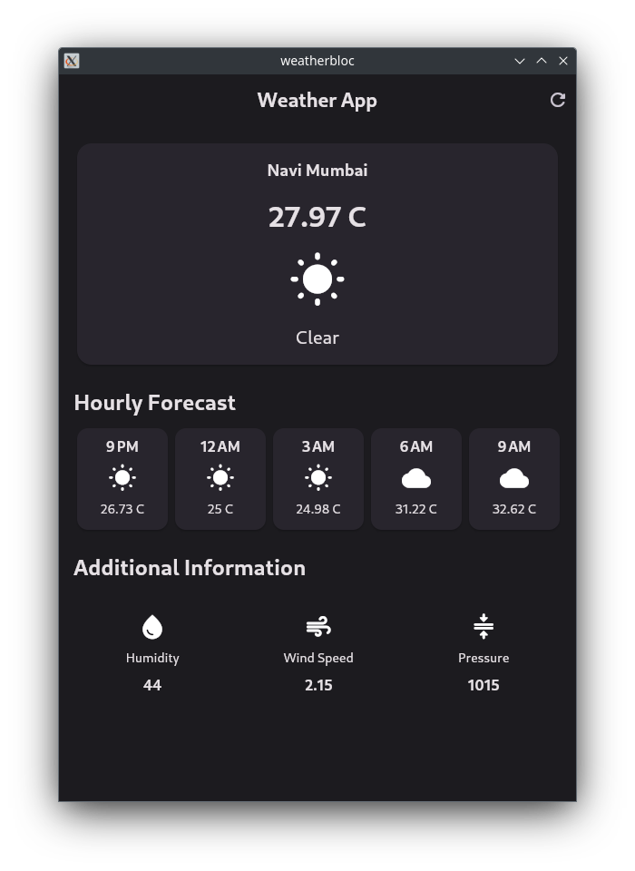

# weatherbloc

Flutter example app showcasing Open Weather API fetch/state management using <a href="https://pub.dev/packages/flutter_bloc">flutter_bloc</a> package.

## Source

The code in this repository is from <a href="https://youtu.be/SDk_GldOtK8?si=2NhQIlpPfWROD7Ks">Flutter Bloc Tutorial For Beginners by Rivaan Ranawat</a> with few changes.

Beginner files/code  - <a href="https://github.com/RivaanRanawat/flutter_bloc_tutorial/tree/master/weather_app_beginner_files">RivaanRanawat/flutter_bloc_tutorial</a>